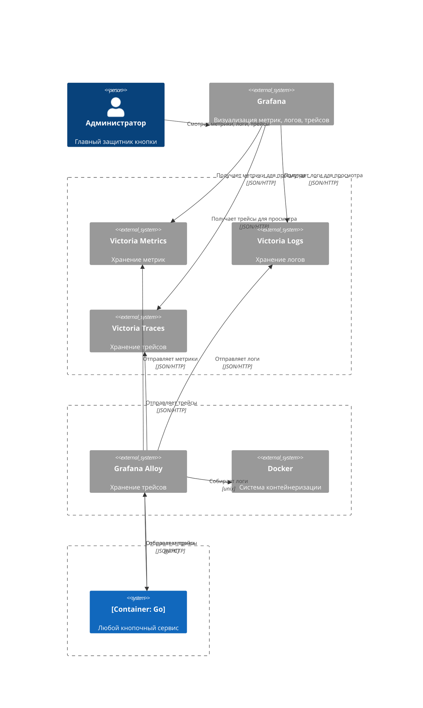

# Buttoners

## Схема сервисов

## Схема инфраструктуры

mermaid версия

## Запустил и открыл по быстрому

- [Метрики](http://metrics.localhost)
- [Логи](http://logs.localhost)
- [Трейсы](http://traces.localhost)
- [Grafana](http://grafana.localhost)
- [Legacy](http://legacy.localhost)
- [Traefik](http://traefik.localhost)
- [Данные в БД](http://db.localhost)
- [Alloy](http://alloy.localhost)
